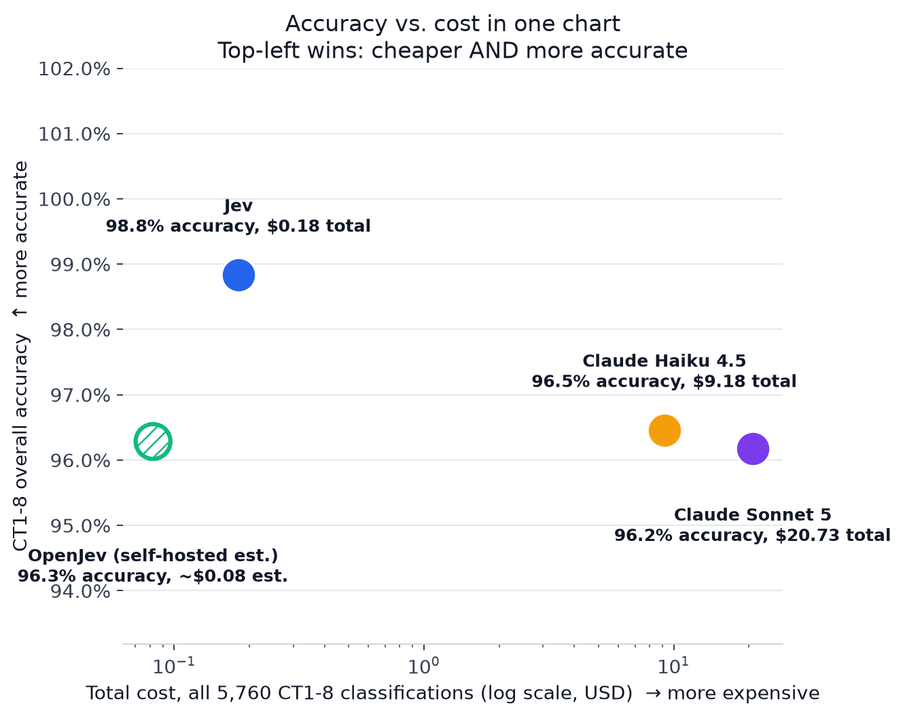
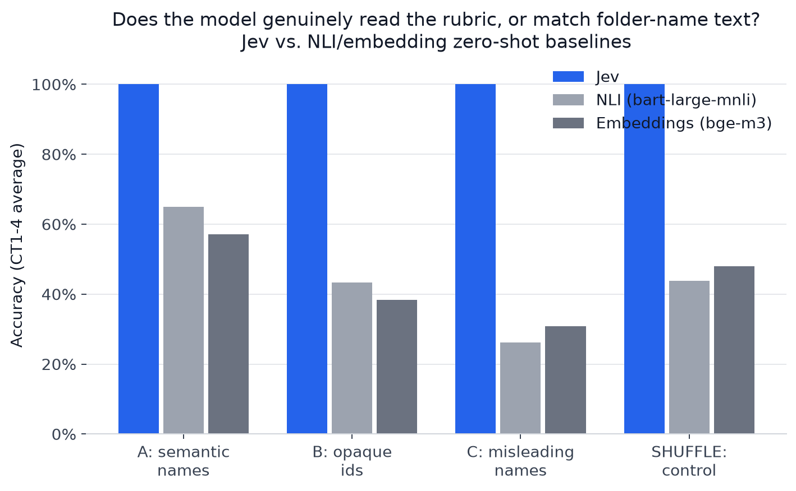
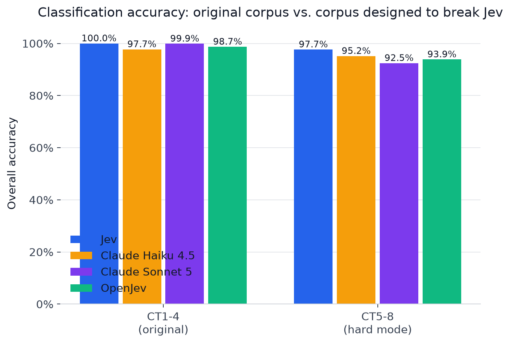
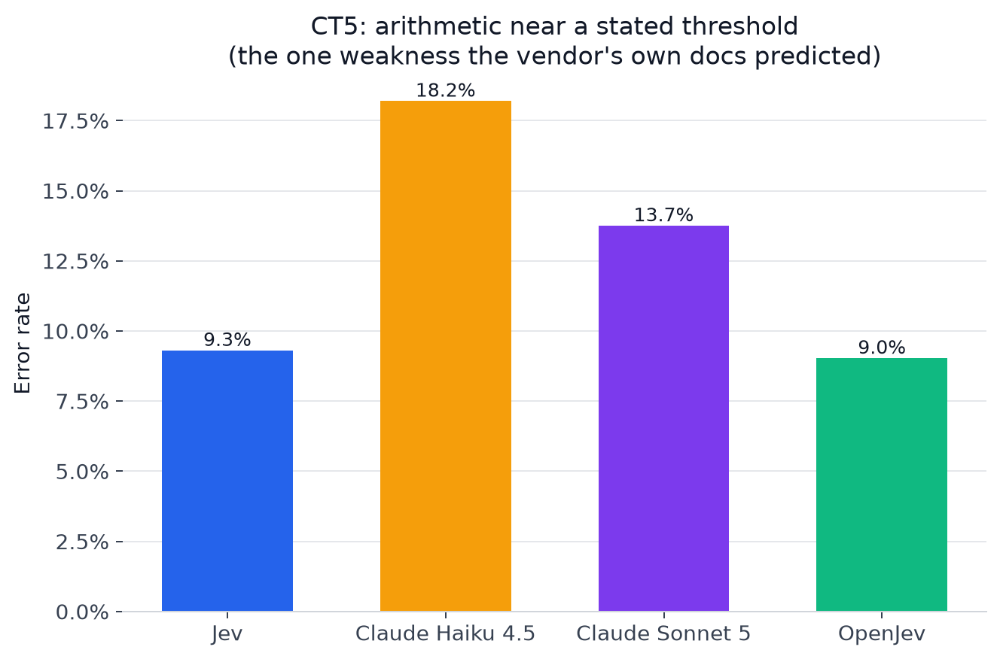
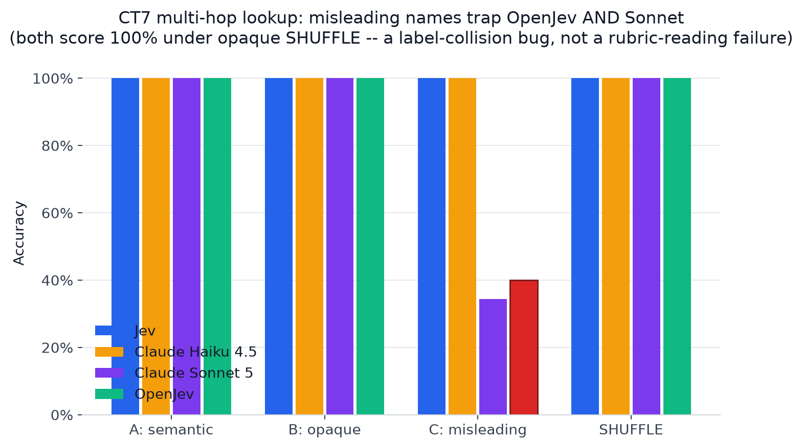
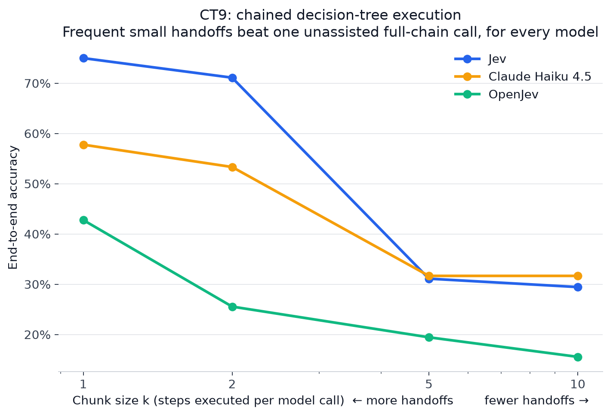
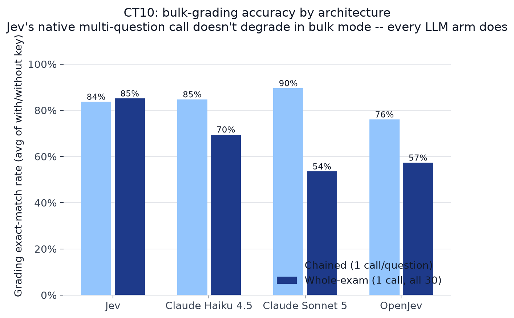
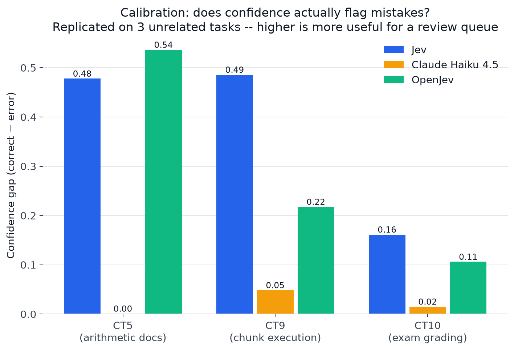
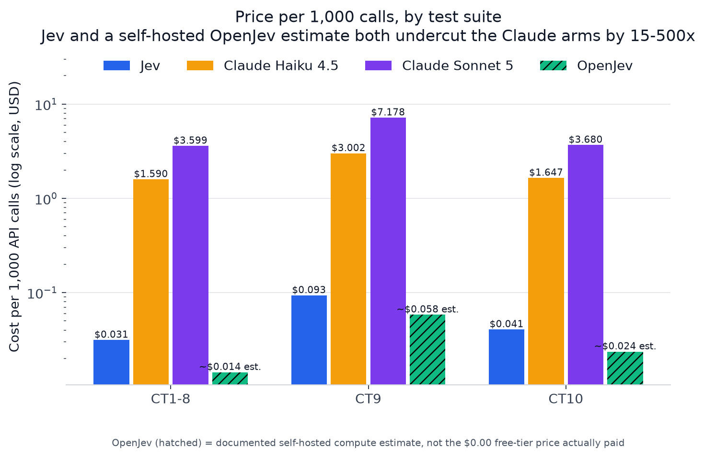
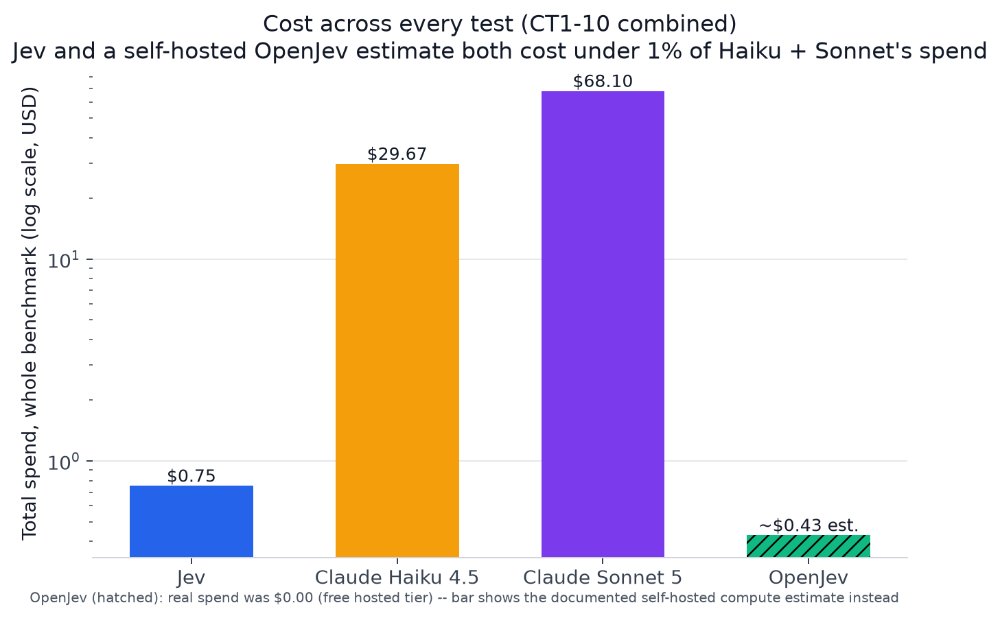

# Jev Benchmark: Rubric-Based Zero-Shot Classification, Chained Execution & Exam Grading

**Does [Jev](https://typesafe.ai) (TypeSafe AI's rubric-conditioned classification model) genuinely
read and apply a multi-clause rubric — and how does it stack up against a general-purpose LLM
(Claude Haiku 4.5) and a free, self-hostable alternative (OpenJev), on both quality *and* price?**

This repo is the full benchmark: every corpus, every prediction, every dollar spent, every test
that failed to find a difference as well as every one that did. Ten structurally distinct test
suites, three models, **124 passing tests**, **$42.01 total spend**, all of it reproducible from
the seeds and scripts in this repo.

<p align="center">
  
</p>

## TL;DR

| | Jev | Claude Haiku 4.5 | OpenJev (free) |
|---|---|---|---|
| **CT1-8 overall accuracy** | **98.83%** | 96.46% | 96.28% |
| **Price per 1,000 calls (CT1-8)** | **$0.031** | $1.590 | $0.000 |
| **Total spend, whole benchmark** | **$0.75** | $29.67 | $0.00 |
| Calibration (confidence flags real errors) | **Consistently useful, 3/3 tasks** | Consistently useless, 3/3 tasks | In between |

**Jev is both more accurate and ~50x cheaper than Haiku on the core classification task** — the
single clearest number in this repo. It also wins on rubric-following under adversarial
relabeling, on the specific arithmetic weakness its own vendor documentation predicted, and on
calibration (its confidence scores actually flag its mistakes; Haiku's don't). Its advantages
are *not* universal, though — they concentrate specifically where task structure favors Jev's
architecture (small-step execution, native multi-question batching) and disappear where it
doesn't. Read on for the receipts.

---

## Table of contents

1. [What this benchmark answers, and why](#what-this-benchmark-answers-and-why)
2. [Models under test](#models-under-test)
3. [The ten test suites](#the-ten-test-suites)
4. [Results, part by part](#results-part-by-part)
   - [Part 1 — Does Jev genuinely read the rubric?](#part-1--does-jev-genuinely-read-the-rubric)
   - [Part 2 — Jev vs. Haiku: head-to-head comparison](#part-2--jev-vs-haiku-head-to-head-comparison)
   - [Part 3 — OpenJev fallback viability](#part-3--openjev-fallback-viability)
   - [Part 4 — CT9: chained decision-tree execution](#part-4--ct9-chained-decision-tree-execution)
   - [Part 5 — CT10: AP World History exam grading](#part-5--ct10-ap-world-history-exam-grading)
   - [Calibration, across every task](#calibration-across-every-task)
5. [Price, in full](#price-in-full)
6. [Methodology highlights](#methodology-highlights)
7. [Reproducing this benchmark](#reproducing-this-benchmark)
8. [Repository layout](#repository-layout)
9. [Full documentation](#full-documentation)
10. [License](#license)

---

## What this benchmark answers, and why

Most "zero-shot classification" benchmarks test whether a model can match a label's *text* to a
document's *content* (NLI entailment, embedding similarity). That's a different, easier task than
what a real rubric-based sorting system needs: **conditioning on an arbitrary, multi-clause set of
rules** — thresholds, exceptions, lookups, negations — regardless of what the destination folders
happen to be named.

This benchmark was built to answer five concrete questions, in order:

1. **Does Jev genuinely condition on the rubric**, or is it secretly doing label-text matching
   like a classifier would? (Part 1 — tested via an adversarial shuffle control.)
2. **Is Jev good enough to replace a cheap general-purpose LLM** for this task, on quality *and*
   price? (Part 2 — Claude Haiku 4.5 as the reference ceiling.)
3. **Is there a viable, free, self-hostable fallback** if Jev's hosted API ever became
   unavailable? (Part 3 — OpenJev, an open-weights model that speaks Jev's exact wire protocol.)
4. **Where does Jev actually break?** A benchmark where the subject scores 100% tells you
   nothing about its limits — so four "hard mode" clause types (Part 2) and a completely
   different task, chained multi-step decision execution (Part 4, CT9), were built specifically
   to find failure modes.
5. **Does any of this generalize to a genuinely different task shape** — partial-credit rubric
   grading of open-ended text, not classification? (Part 5, CT10.)

Every design decision below — the seeded-RNG discipline, the shuffle control, the price ledger,
the decision to build *harder* tests once the easy ones stopped being informative — is documented
with its rationale in [`methodology.md`](./methodology.md), including the places where an initial
approach turned out to be wrong and was replaced.

## Models under test

| Model | What it is | Pricing (list) |
|---|---|---|
| **Jev** (`jev-1.13`) | TypeSafe AI's purpose-built rubric-classification model. Three primitives: `Noul` (yes/no), `Choice` (pick 1 of ≤255 options), `Score` (rate against an ordered rubric). | $0.042 / Mtok input, **output free** |
| **Claude Haiku 4.5** | Anthropic's fast general-purpose LLM — the reference-ceiling comparison arm. | $1 / Mtok input, $5 / Mtok output |
| **OpenJev** | `razorback16/openjev`, an open-weights model (DiffusionGemma 26B-A4B, Apache-2.0) that speaks Jev's exact wire API. Tested via the free-hosted [Codiv](https://codiv.ai) endpoint. | **Free** (hosted tier) |
| NLI (bart-large-mnli) / Embeddings (bge-m3) | Standard zero-shot classification baselines — the "does it actually read the rubric" control group for Part 1. Not real contenders (they can't follow a rubric at all), included to prove the point. | Local, free |

## The ten test suites

| Suite | Tests | Ground truth |
|---|---|---|
| CT1 descriptive | Simple 3-way document type sort | Structured metadata |
| CT2 conjunctive+threshold | Numeric threshold rule | Structured metadata |
| CT3 relational | Lookup + override exception | Structured metadata |
| CT4 negative/exclusionary | Negation-based rule | Structured metadata |
| CT5 computed_threshold | **Arithmetic**: sum stated line items, no total given | Structured metadata |
| CT6 temporal_reasoning | Date comparison, zero narrative cues | Structured metadata |
| CT7 multi_hop_relational | Two chained lookups (team → division → program) | Structured metadata |
| CT8 long_context_distractor | Same logic as CT1, buried in ~600-word padding | Structured metadata |
| CT9 chained decision execution | 10-layer decision tree, walked in 1/2/5/10-step chunks, 4 outcome folders | Code-computed tree walk |
| CT10 exam grading | Partial-credit rubric grading of 30 AP World History paragraph answers, 100 students | Seeded student-ability model |

CT1-4 is the original design. CT5-8 ("hard mode") and CT9/CT10 were built afterward, specifically
because CT1-4 turned out to be a ceiling task (Jev: 100%) — a benchmark that never finds a failure
can't characterize one.

---

## Results, part by part

### Part 1 — Does Jev genuinely read the rubric?

<p align="center"></p>

The critical test: **Condition C** relabels folders with *misleading* but semantically real names
(a text-matcher's worst case), and the **SHUFFLE control** adversarially permutes the
rubric-clause-to-folder-ID mapping under opaque IDs. If Jev were secretly doing label-text
matching, its accuracy under these conditions would collapse toward the NLI/embedding baselines.
**It doesn't — Jev stays at 100.00% in every single condition**, while the baselines collapse to
26-48%. This is the foundational result everything else builds on.

**Price**: this part uses only local, free baselines plus Jev — CT1-4 corpus generation cost
**$1.06** total (one-time Sonnet 5 cost to build the 240-document corpus), Jev's own inference
cost **$0.18** for all 2,880 classifications.

### Part 2 — Jev vs. Haiku: head-to-head comparison

<p align="center"></p>

| | Jev | Haiku |
|---|---|---|
| CT1-4 (original corpus) | **100.00%** | 97.74% |
| CT5-8 (hard mode, built to find Jev's limits) | **97.67%** | 95.17% |
| **Price, CT1-4 + CT5-8 combined (5,760 calls)** | **$0.18** | **$9.18** |

**Jev wins on both accuracy and price**, by a wide margin on price (**~50x cheaper**). Digging
into *why* CT5-8 exists:

<p align="center"></p>

Jev's one real weakness anywhere in CT1-8 — arithmetic near a stated threshold — was predicted in
advance by the vendor's own model documentation. It's real (9.3% error rate), but **Haiku is
worse at it** (18.2%, exactly 2x). Two other predicted weaknesses (multi-hop lookup, long-context
distraction) never materialized for either model — reported as clean negative results, not
hidden.

**Result, per the pre-registered comparison rule in [`test-plan.md`](./test-plan.md): Jev matches
or exceeds Haiku on accuracy** in every scope tested, at ~50x lower price — a wide margin on both
axes of the comparison.

### Part 3 — OpenJev fallback viability

<p align="center"></p>

OpenJev is **free** and scores 96.28% overall on CT1-8 — a genuinely viable zero-cost fallback for
simple classification. It has exactly one sharp, fully-diagnosed weakness: CT7's multi-hop lookup
collapses to 40% under Condition C specifically (red bar above) — but the *identical* tree scores
100% under the SHUFFLE control (opaque random IDs). That rules out "OpenJev can't follow the
rubric" — it's a label-*collision* bug (Condition C's misleading names are other real, plausible
labels; SHUFFLE's aren't), isolated to one clause type under one condition.

**Price**: $0.00, always — the free Codiv tier never touched the $50 Anthropic budget for any of
CT1-8, CT9, or CT10.

**Verdict**: viable free fallback for CT1-8-style classification; not yet viable for CT9-style
chained execution (see below) — meaningfully behind both other models at every step size.

### Part 4 — CT9: chained decision-tree execution

<p align="center"></p>

A completely different task from CT1-8: walking a 10-layer decision tree in chunks of size
k ∈ {1, 2, 5, 10}, with **real compounding** between chunks (no ground-truth rescue). The
headline finding inverts the a priori hypothesis: going in, more handoffs (lower k) was expected
to *hurt* accuracy via compounding error. **It's the opposite for every model** — frequent small
handoffs beat one unassisted full-chain call, decisively.

**Jev's advantage is real but narrow**: +17-22pp over Haiku at k=1/2, but statistically tied at
k=5/10 — Jev's edge is about small-step execution discipline, not raw multi-hop reasoning
capacity. **The one place in this whole benchmark where Jev is *less* stable than Haiku**: at
k=10, Jev disagrees with itself across repeats 8.3% of the time vs. Haiku's 0% — reported as
found, not smoothed over, since it's also Jev's single worst accuracy result anywhere in this
project.

**Price**: 900 traces × 3 arms = 3,420 API calls per model. Jev **$0.32**, Haiku **$10.27**,
OpenJev **$0.00** — Jev's per-call cost advantage holds even on this much more demanding
multi-step task (**~32x cheaper per 1,000 calls**, see [Price, in full](#price-in-full)).

### Part 5 — CT10: AP World History exam grading

<p align="center"></p>

A third structurally distinct task: partial-credit rubric grading of open-ended paragraph
answers (30 questions, 100 simulated students, non-uniform rubric summing to 100 points), with an
orthogonal axis — does the grading model need the answer key, or does it already know the
material? Two grading modes: **chained** (1 call/question) and **whole-exam** (1 call, all 30
questions at once).

**A genuine architecture-driven finding**: Jev is essentially flat between chained and whole-exam
grading (its `system_one` call natively evaluates multiple `Score` questions in parallel, so its
"whole exam" call is structurally ~30 independent judgments). **Haiku and OpenJev both lose
15-22 percentage points in whole-exam mode** — their single-shared-JSON-object approach to "many
answers in one call" is a genuinely harder task shape. This is avoidable by architecture, not an
inherent model-quality gap.

On the knowledge question: **Haiku needs the answer key the least** (its own historical knowledge
does almost as much work as being handed the key, +2.5-3pp gap vs. Jev's +5-7pp) — a genuinely
different profile from the accuracy/price story above.

**Price**: 6,200 grading actions × 3 arms = 18,600 calls. Jev **$0.25**, Haiku **$10.22**,
OpenJev **$0.00**.

### Calibration, across every task

<p align="center"></p>

The single most decision-relevant number in this whole repo, replicated on **three structurally
unrelated tasks**: does a model's confidence actually predict whether it's wrong? **Jev's does,
consistently.** Haiku's confidence is nearly flat between correct and incorrect answers — it
fails *confidently*, giving a downstream review queue nothing to act on. A rule like "route
anything under 0.6 confidence to human review" would catch the large majority of Jev's mistakes;
the equivalent rule for Haiku would catch almost none of them.

---

## Price, in full

Price is a first-class result in this benchmark, not an afterthought — every table above includes
it, and here's the full picture:

<p align="center">
  
  
</p>

| Model | CT1-8 (5,760 calls) | CT9 (3,420 calls) | CT10 (~6,200 calls) | **Total, all arms** |
|---|---|---|---|---|
| Jev | $0.18 | $0.32 | $0.25 | **$0.75** |
| Claude Haiku 4.5 | $9.18 | $10.27 | $10.22 | **$29.67** |
| OpenJev | $0.00 | $0.00 | $0.00 | **$0.00** |

**Jev and OpenJev combined cost less than 3% of Haiku's spend across the entire benchmark.**
Corpus generation (one-time, via Claude Sonnet 5, to build the 480 CT1-8 documents + 60 CT9 forms
+ 100 CT10 exams) cost an additional $11.59 — not a recurring cost, since the corpus itself is
committed to this repo and never needs regenerating. **Grand total: $42.01**, all logged to
[`results/spend_ledger.jsonl`](./results/spend_ledger.jsonl) call-by-call as it was spent, not
estimated after the fact.

## Methodology highlights

Full detail in [`methodology.md`](./methodology.md) (15 sections, one per phase); the highlights
that matter most for trusting these results:

- **Seeded RNG discipline.** Every choice that should be uninfluenced by semantics — opaque folder
  IDs, the shuffle-control permutation, which criteria a partial-credit answer satisfies, student
  ability — is drawn from `harness.constants.sub_rng(purpose)`, an independently-reproducible
  stream keyed off one `MASTER_SEED`. Nothing here was hand-picked to look good.
- **The shuffle control** (Part 1) is the load-bearing methodological device of this whole
  project: it's the one test that can actually distinguish "the model reads the rubric" from "the
  model matches folder-name vibes," and it was applied to every classification-shaped task.
- **Price tracked as it was spent**, not estimated afterward — every API call, successful or not,
  is logged to `results/spend_ledger.jsonl` with a hard budget ceiling enforced *before* the call
  that would exceed it, not after.
- **Negative results are reported, not hidden.** CT7 and CT8 (hard mode) found no weakness for
  either Jev or Haiku. CT9 found Jev *less* stable than Haiku at k=10. Both are in the numbers
  above, not filtered out.
- **Decomposition frozen up front** (test-plan.md §8): rubric-clause granularity is a large free
  parameter that can make a task look artificially easy or hard; the exact decomposition is fixed
  before any arm sees the test set and applied identically across every arm.

## Reproducing this benchmark

```bash
uv sync
cp .env.example .env   # fill in TYPESAFE_API_KEY, ANTHROPIC_API_KEY, CODIV_API_KEY

# Everything below is already committed (corpus, predictions, spend ledger) --
# these commands regenerate results from what's already here, or extend it.
pytest tests/ -q                        # 124 tests, exercises every scoring function
python -m harness.spend_ledger          # print the full price ledger
python -m scripts.generate_summary      # rebuild results/summary.{json,csv}
python -m scripts.generate_charts       # rebuild every chart in charts/

# Re-running an arm against already-generated corpora (resumable, will skip
# anything already in results/predictions/):
python -m scripts.run_arm --arm nli-bart
python -m scripts.run_api_arm --arm jev        # or haiku / openjev
python -m qtree.runner --arm jev               # CT9
python -m examgrade.runner --arm jev           # CT10
```

Regenerating the corpus from scratch (not needed — it's committed — but fully reproducible):
`corpus/generate_metadata.py` → `corpus/generate_prose.py` (and the `qtree`/`examgrade`
equivalents), all seeded from `MASTER_SEED` in `harness/constants.py`.

## Repository layout

```
corpus/       CT1-8 document generator + frozen manifest + ground-truth engine
rubrics/      Rubric clause text, folder-name conditions, shuffle-control permutation
arms/         One module per CT1-8 arm: jev, haiku, openjev, nli-bart, emb-bge
qtree/        CT9: decision tree, chunked execution arms, scoring
examgrade/    CT10: exam questions/rubrics, student corpus, grading arms, scoring
harness/      Shared scoring (bootstrap CI, ECE, disagreement), spend ledger, constants
scripts/      run_arm / run_api_arm (CT1-8), generate_summary, generate_charts
results/      Every raw prediction, the spend ledger, and the consolidated summary
charts/       Every chart in this README, regenerable via scripts/generate_charts.py
tests/        124 tests covering ground truth, RNG determinism, and every scoring function
```

## Full documentation

- [`test-plan.md`](./test-plan.md) — the original design document (written before any code existed)
- [`methodology.md`](./methodology.md) — every decision made, in order, including what didn't work
- [`results.md`](./results.md) — the full numeric results this README summarizes
- [`results/summary.json`](./results/summary.json) / [`results/summary.csv`](./results/summary.csv) — every computed metric, machine-readable

## License

[MIT](./LICENSE).
